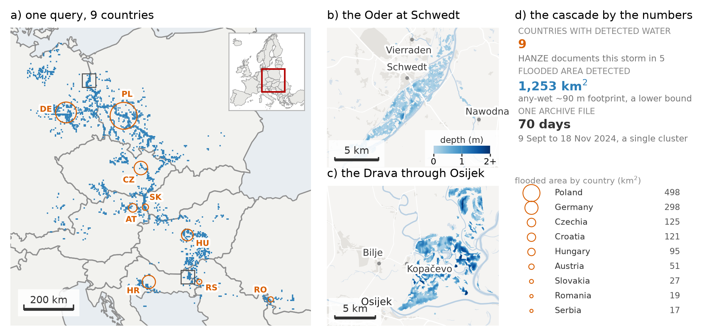
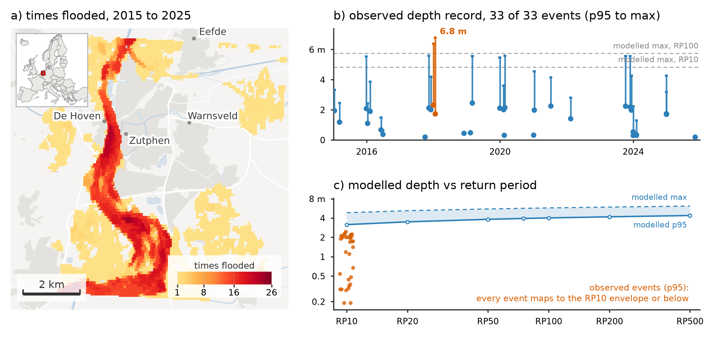
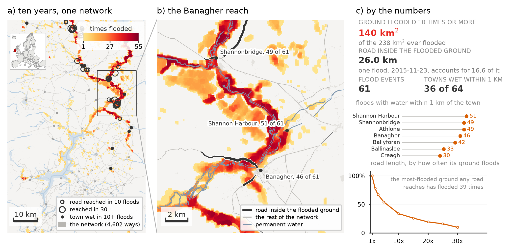
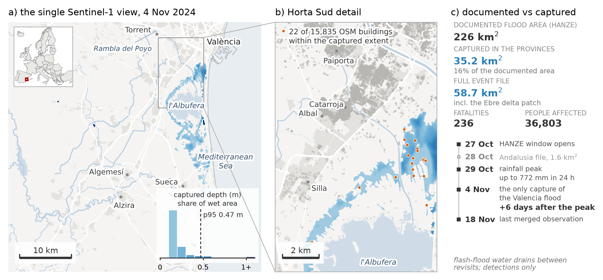
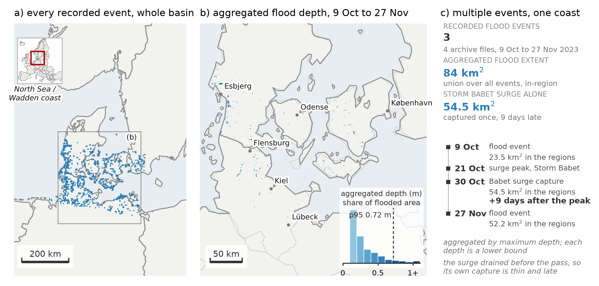

# Case studies

Real-world flood analyses built with `euroflood`, reproduced from the EuroFlood
paper. Where the [tutorials](../tutorials/README.md) teach one feature at a time on a
single place, these case studies combine the whole workflow (discover → attribute →
download → measure → compare against modelled hazard) on genuine events across Europe,
and are honest about what satellite detection can and cannot see.

-   [{ .no-crop }](01_boris_transboundary.ipynb)

    __[Storm Boris: a transboundary flood](01_boris_transboundary.ipynb)__

    One query resolves a 70-day, nine-country cluster (Sept 2024); per-country NUTS-0
    attribution and observed depth on the Oder and Drava.

-   [{ .no-crop }](02_zutphen_decade.ipynb)

    __[A decade at Zutphen](02_zutphen_decade.ipynb)__

    Ten years of flooding on the IJssel: per-cell recurrence, per-event depth, and
    observed depths placed against modelled GLOFAS return periods.

-   [{ .no-crop }](03_shannon_callows.ipynb)

    __[Shannon callows: infrastructure screening](03_shannon_callows.ipynb)__

    Recurrence over the Irish midlands intersected with the OSM road and settlement
    network to estimate exposed infrastructure.

-   [{ .no-crop }](04_valencia_dana.ipynb)

    __[Valencia DANA: a detectability limit](04_valencia_dana.ipynb)__

    A rapid-onset event (Oct 2024) where a single, delayed Sentinel-1 pass captures
    only ~16% of the documented flooded area, a worked example of what the archive misses.

-   [{ .no-crop }](05_baltic_surge.ipynb)

    __[Baltic storm surge: coastal detectability](05_baltic_surge.ipynb)__

    Storm Babet (Oct 2023): residual coastal inundation captured nine days after the
    peak, illustrating the limits of a fluvial-oriented archive at the coast.

-   [{ .no-crop }](06_continental_recurrence.ipynb)

    __[A decade of European flood recurrence](06_continental_recurrence.ipynb)__

    How often each place in Europe was detected flooded (2015–2025), from a single index
    query; the most repeatedly flooded cell is the Vouga/Aveiro floodplain in Portugal
    (89 times).

## Reproducing these

These notebooks are **reproduced from the paper and shown here with their committed
outputs**: every `euroflood` call is real, and the final cell of each displays the
corresponding published figure for comparison. They are **not executed in this
project's CI** and are not runnable in place: some steps read external inputs (OSM
networks, HANZE impact records, GISCO NUTS boundaries).

The paper's figures, its derived data, and the analysis code that recreates them are
archived as a reproduction package on Zenodo. To re-run a notebook yourself, install
`euroflood[viz]` and supply those inputs under `case_studies/data/`:

> Hackl, J. (2026). *EuroFlood paper reproduction package: figures, derived data, and
> analysis code* (Version v1.0.0) [Dataset]. Zenodo.
> <https://doi.org/10.5281/zenodo.21510351>

For a runnable, step-by-step introduction to the API, start with the
[tutorials](../tutorials/README.md) instead.
