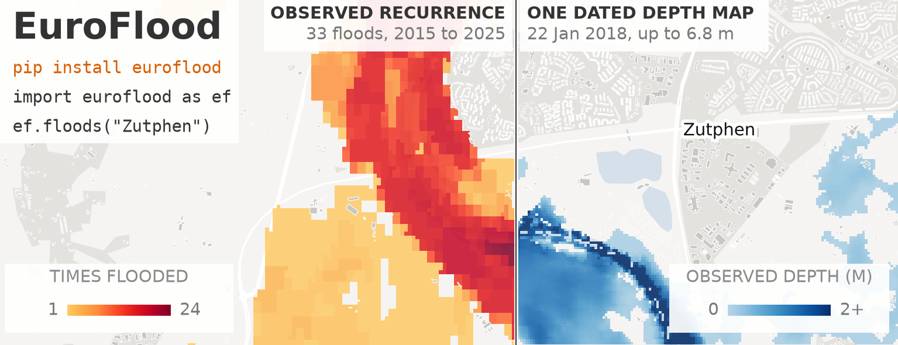

# Citing EuroFlood

If EuroFlood helps your work, please cite **the software**, **the index dataset**, and
**the source data** it builds on. Each has its own persistent identifier.

{ width="760" }

## Cite the software

The repository ships a [`CITATION.cff`](https://github.com/cisgroup/euroflood/blob/main/CITATION.cff),
so GitHub's **"Cite this repository"** button generates an up-to-date reference.

Each release is archived on Zenodo. Cite the **version** you used for reproducibility, or
the **concept DOI** to point at whatever is latest:

- **v0.3.0:** DOI [`10.5281/zenodo.22837459`](https://doi.org/10.5281/zenodo.22837459)
- **Concept DOI** (always resolves to the latest release):
  [`10.5281/zenodo.22837458`](https://doi.org/10.5281/zenodo.22837458)

A BibTeX entry for the current release (the concept DOI resolves to it):

```bibtex
@software{hackl_euroflood,
  author    = {Hackl, J\"urgen},
  title     = {{EuroFlood: query Europe's satellite flood-depth maps by place and time}},
  year      = {2026},
  version   = {0.3.1},
  license   = {MIT},
  publisher = {Zenodo},
  doi       = {10.5281/zenodo.22837458},
  url       = {https://doi.org/10.5281/zenodo.22837458}
}
```

!!! note "Software and dataset carry different DOIs"
    The DOIs above identify the **library**. The flood index it reads is a separate
    artifact with its own DOI, below. Citing one does not cite the other.

## Cite the index dataset

The published index (the COG + dictionary + events table + manifest) is archived on
Zenodo and mirrored on [Source Cooperative](https://source.coop/hackl/euroflood-index).
Cite the **version** you used for reproducibility, or the **concept DOI** to point at
whatever is latest:

- **v1.1.0** (current, coverage 2015-2025): DOI
  [`10.5281/zenodo.22834747`](https://doi.org/10.5281/zenodo.22834747)
- **v1.0.0** (coverage 2015-2024): DOI
  [`10.5281/zenodo.21284460`](https://doi.org/10.5281/zenodo.21284460)
- **Concept DOI** (always resolves to the latest version):
  [`10.5281/zenodo.21284459`](https://doi.org/10.5281/zenodo.21284459)

```bibtex
@dataset{hackl_euroflood_index,
  author    = {Hackl, J\"urgen},
  title     = {{EuroFlood index}},
  year      = {2026},
  publisher = {Zenodo},
  version   = {v1.1.0},
  doi       = {10.5281/zenodo.22834747},
  url       = {https://doi.org/10.5281/zenodo.22834747}
}
```

## Cite the source data

The flood-depth maps and hazard layers are produced by the JRC / Copernicus Emergency
Management Service and are **not** created by EuroFlood. Please cite them too.

- **Observed flood depth (CEMS-EFAS):** Betterle, A. & Salamon, P. (2025). *Satellite-Derived
  Flood Depth Maps for Europe.* European Commission, Joint Research Centre (JRC) /
  Copernicus EMS. CC-BY-4.0.
  [Dataset](https://data.jrc.ec.europa.eu/dataset/0bc96690-b89c-4909-9166-c2c322a20130).
- **Modelled hazard (CEMS-GLOFAS):** the CEMS-GLOFAS river-flood hazard maps (v2.1.2),
  when you use `ef.hazard(...)`.

## Reproduction package

All of the paper's figures, its derived data, and the analysis code that recreates them are
archived on Zenodo:

- **v1.0.0:** DOI [`10.5281/zenodo.21510351`](https://doi.org/10.5281/zenodo.21510351)

> Hackl, J. (2026). *EuroFlood paper reproduction package: figures, derived data, and
> analysis code* (Version v1.0.0) [Dataset]. Zenodo.
> <https://doi.org/10.5281/zenodo.21510351>

```bibtex
@dataset{hackl_euroflood_repro,
  author    = {Hackl, J\"urgen},
  title     = {{EuroFlood paper reproduction package: figures, derived data, and analysis code}},
  year      = {2026},
  publisher = {Zenodo},
  version   = {v1.0.0},
  doi       = {10.5281/zenodo.21510351},
  url       = {https://doi.org/10.5281/zenodo.21510351}
}
```

## The paper

!!! note "In preparation"
    A methods paper describing the index and library is in preparation. Once it is
    public, its citation (and a preferred-citation entry in `CITATION.cff`) will appear
    here. Until then, please cite the software and dataset above.
