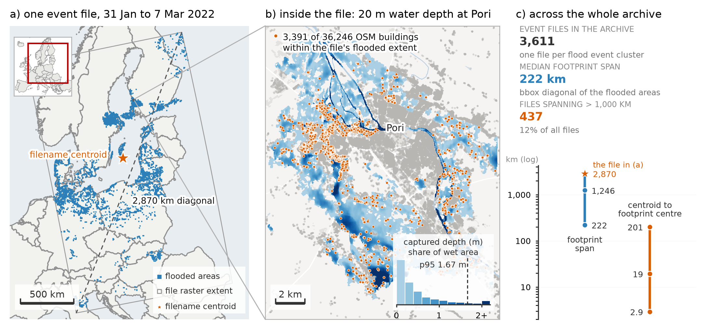
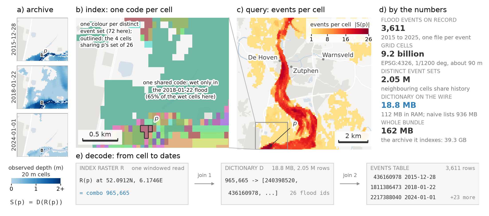
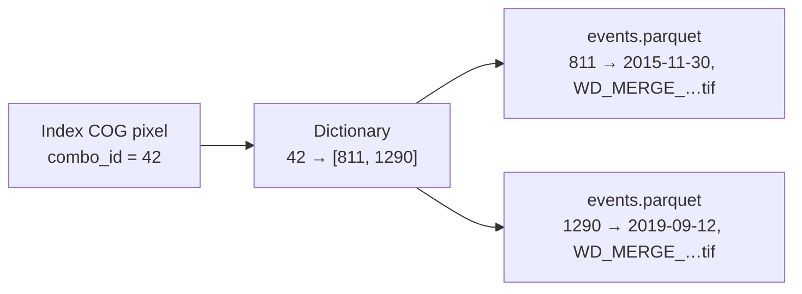
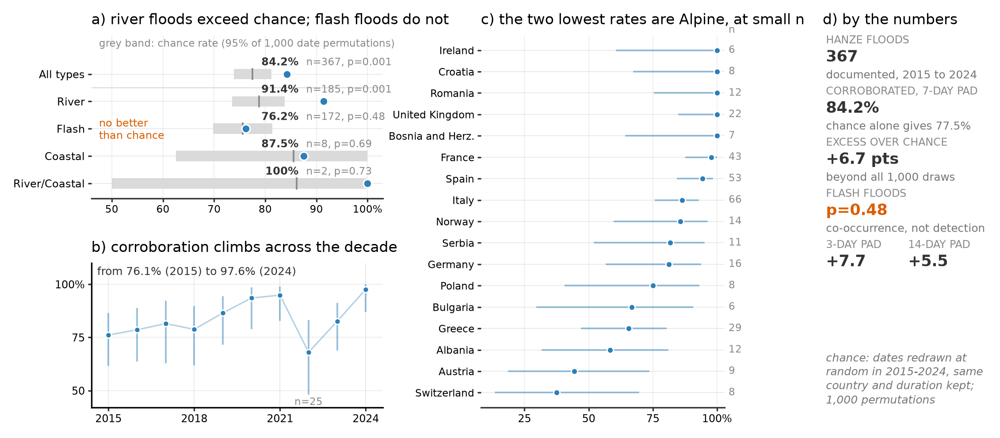

# Concepts: how the index works

This page explains the one idea that makes the rest of EuroFlood click: **how a
huge, un-indexed archive of flood rasters becomes a query you can run in
milliseconds and a few megabytes.** You don't need this to *use* the library, but
it explains why `floods()` is cheap, why recurrence and footprints need no
download, and what all the files in the cache are.

## The problem

The JRC / CEMS-EFAS archive is ~3,610 satellite flood-depth GeoTIFFs (~39 GB of
depth rasters), distributed through a flat HTTP directory with no API, catalogue, or
spatial index. The only geolocation you get without opening a file is a centroid
encoded in its filename, and a single event file can contain flooded areas up to
2,870 km apart, so that centroid cannot represent the event. Filtering by filename
therefore misses most events relevant to a place: a generous 2° buffer recovers at most
~48% of events, and precision falls to ~10% at city scale.

{ width="720" }

The archive is open in principle but hard to query in practice. EuroFlood precomputes an
**index** so that "which floods hit Zutphen, and when?" becomes a single small raster
read instead of a scan of every tile.

## The building blocks

The whole index is three artifacts (a raster, a dictionary, and a table), built and
decoded as shown below. The rest of this section walks through each piece.

{ width="760" }

### 1. A global grid

All maps are resampled onto one fixed lat/lon grid: **EPSG:4326 at 1/1200°**
(≈3 arc-sec, ≈90 m pixels), covering Europe. (The source depth rasters are native
20 m; the index trades that resolution for a compact, uniform grid.) Every pixel has a
stable `(row, col)` address, so "the same place" means "the same pixel" across all
events.

### 2. The index COG: a pixel is a *set of events*

The index is a single **Cloud-Optimized GeoTIFF** (`europe_flood_index.tif`) on
that grid. Each pixel holds a `uint32` **`combo_id`**:

- `0`: never flooded (the vast majority; the COG is *sparse* and compresses to
  **142 MB**).
- `N > 0`: a **combination id**, a stable handle for *the exact set of flood
  events that flooded this pixel*.

Many pixels share the same set of events, so there are far fewer distinct
`combo_id`s than pixels. That's what keeps the index small.

!!! info "Why ~161 MB is enough"
    Europe is ~9.2 billion grid cells. Only **89.6 million** (1.0%) were ever wet, and
    those resolve to just **2.05 million** distinct event combinations. So instead of a
    dense 37 GB raster, or ~891 MB of explicit per-cell event lists, the index stores
    a **142 MB** COG + an **18.8 MB** dictionary + a **0.4 MB** events table: about
    **161 MB** in total, versus ~39 GB of source depth rasters.

### 3. The dictionary: `combo_id → flood_ids`

A small sorted GeoParquet (`flood_dictionary.parquet`) maps each `combo_id` to the
list of flood-event ids that produced it:

```text
combo_id  ->  flood_ids
   42     ->  [811, 1290]        # this combo = events 811 and 1290
   43     ->  [811]
```

### 4. The events table: `flood_id → metadata`

A tiny `events.parquet` maps each `flood_id` to its metadata (start/end date, year,
cluster, source filename + download URL). Storing metadata *once* here, instead of
repeating it inside every combo, keeps the dictionary + events table to ~19 MB with no
information loss.



## Discover → Extract

EuroFlood follows a two-stage model. **Discovery** finds which events affected a region,
when they occurred, and how often cells were inundated, using only the ~161 MB index.
**Extraction** then retrieves native-resolution depth rasters, but only for the events
you selected. So a query resolves in two cheap steps, then an optional extract:

1. **Resolve the region**: a place name (geocoded), bbox, point+radius, or
   shapefile becomes an ROI polygon. `shape="bbox"`/`"hull"` optionally regularizes
   it to a bounding rectangle / convex hull (handy when an admin boundary follows a
   river), and `buffer_m` grows it.
2. **Discover**: mask the index COG to the ROI (reading only that window), collect
   the distinct `combo_id`s, expand them to `flood_ids` via the dictionary, and join
   the events table for metadata. The result is a `FloodFrame`, one row per event.
   No depth rasters are touched.
3. **Extract** (opt-in): `.download()` fetches and crops only the source depth
   GeoTIFFs for the events you selected.

That's why `floods("Zutphen, Netherlands")` transfers a few MB and returns instantly, while the
actual depth data is fetched only when you ask.

## Local vs. remote index

The same index can live locally or be streamed:

- **Remote (default for the published index):** the COG is read a window at a time
  over HTTP via GDAL's `/vsicurl`, and only the **~19 MB** dictionary + events tables
  are cached on first use (SHA-256-verified). A query downloads a few MB, never the
  whole index. Controlled by `EUROFLOOD_INDEX_MODE` / `EUROFLOOD_INDEX_BASE_URL`.
- **Local:** everything is read from the cache directory. `euroflood mirror index`
  pulls the full **~161 MB** bundle once for fully-offline / HPC use.

**Hazard has a parallel switch, `hazard_mode`** (`auto`/`local`/`remote`), and both
collections share a master `EUROFLOOD_OFFLINE=1` / `euroflood.offline()` toggle that forces
everything cache-only and the geocoder offline. Stage data with `euroflood mirror
index|floods|hazard|all` and gate readiness with `euroflood verify … --deep`. In `local`/offline
mode a missing tile raises a clear error naming the `mirror` command to run, never a silent
partial result.

## What the visualizations reuse

Because the index already encodes *which events hit each pixel*, several views come
for free, no download:

- **Recurrence heatmap**: per pixel, `len(flood_ids)` is exactly *how many times it
  flooded*. Darker = more floods.
- **Per-event footprints**: an event's extent is the union of pixels whose
  `combo_id` includes that event; `.footprints()` returns one geometry per event.
- **Depth map**: the only view that needs the actual raster, hence `depth=True`
  downloads it.

So most views cost nothing beyond the query; only the depth map touches the network:

| Call | Network / disk | Shows |
|---|---|---|
| `cat.plot()` / `.explore()` | none | recurrence heatmap (historic) / context (hazard) |
| `cat.plot(event_id=…)` | none | one event's footprint |
| `cat.footprints()` / `cat.plot(footprints=True)` | none | each event's extent (data + map) |
| `cat.plot(depth=True, …)` | downloads rasters | actual water-depth map |
| `ef.plot_depth(path)` | none | a depth map from a downloaded GeoTIFF |

See **[Tutorial 3: Visualize](tutorials/03_visualize.ipynb)** for the full gallery.

## How complete, and how trustworthy

The index reconstructs the archive's event footprints **exactly** at its ~90 m grid:
across 100 events sampled from the 2015–2024 decade, footprints decoded from the
published index match an independent re-ingest of the source rasters with an
**IoU of 1.000**: no missing or spurious cells, no missing or spurious events.
Queries also return **byte-identical** results whether streamed from the public
host, a local mirror, or a private replica.

And the index is fast because discovery reads only a *window* of it. Computing
recurrence for the whole Netherlands, for example, is a **15.2 MB** windowed read of the
index versus **3.9 GB** of source rasters, a **254×** reduction; marginal queries
transfer just 0.12–0.91 MB.

How complete is the archive itself? The figures below were computed on the 2015–2024
subset of the archive. Compared against HANZE, an independent European flood-impact
database (367 floods, 2015–2024), **84.2%** of documented floods coincide
with an archived event in the same country within a week, well above the ~77.5% expected
by chance. The signal is strongest for **river floods (91.4%)** and indistinguishable
from chance for **flash floods (76.2%)**, and completeness rises across that decade
(76.1% in 2015 → 97.6% in 2024). The 2025 events added in index v1.1.0 are not yet
covered by this audit.

{ width="720" }

## Interpreting your results

The index answers "where and when has flooding been **detected**?", not "where has
flooding **occurred**?" A few things to keep in mind:

!!! warning "Detected ≠ complete"
    An absent or spatially limited footprint does **not** mean flooding was absent.
    Sentinel-1 under-detects short-lived, urban, vegetated, and topographically confined
    events (see the [Valencia DANA](case-studies/04_valencia_dana.ipynb) and
    [Baltic surge](case-studies/05_baltic_surge.ipynb) case studies).

!!! note "Recurrence is a detection count, not a return period"
    A recurrence value is *how many archived events touched a cell*, not a hydrological
    frequency or return period. Two nearby cells can differ simply because of when
    satellites happened to observe them.

!!! important "Use the index for discovery, the 20 m rasters for measurement"
    The any-wet resampling that keeps the index lossless also **enlarges** footprints:
    a median **1.49×** area inflation (mean 1.53; 10th–90th percentile 1.27–1.82)
    relative to the native 20 m wet area. Use the index for discovery, recurrence, and
    spatial selection; compute inundated **area, depth, and volume** from the downloaded
    20 m rasters (`.download().stats()`).

Modelled **GLOFAS** hazard maps and observed footprints are different representations
(a return-period scenario versus what a satellite saw on specific dates), so treat them
as complementary, not as validations of each other. Depths themselves are reconstructed
(FLEXTH), accurate to roughly a decimetre (RMSE 0.28–0.62 m).

## The cache, at a glance

A built/mirrored index bundle contains:

| File | What it is |
|---|---|
| `europe_flood_index.tif` | the sparse COG (pixel = `combo_id`) |
| `flood_dictionary.parquet` | `combo_id → flood_ids` |
| `events.parquet` | `flood_id → metadata` |
| `dictionary_meta.json` | schema/version/layout |
| `manifest.json` | provenance + checksums (the publish/validate contract) |

Producers build these with `mirror → ingest → build-index`; see the
[HPC Runbook](hpc-runbook.md).
