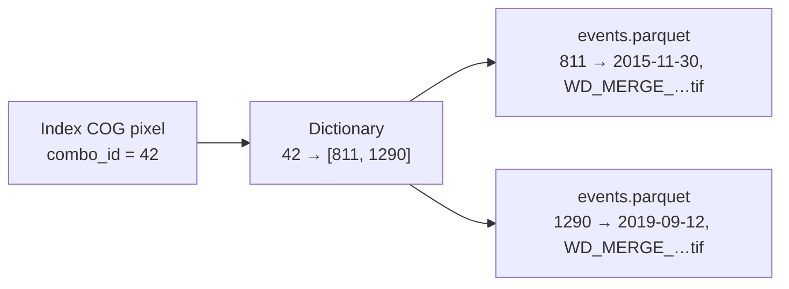

# Concepts — how the index works

This page explains the one idea that makes the rest of EuroFlood click: **how a
huge, un-indexed archive of flood rasters becomes a query you can run in
milliseconds and a few megabytes.** You don't need this to *use* the library, but
it explains why `floods()` is cheap, why recurrence and footprints need no
download, and what all the files in the cache are.

## The problem

The JRC / CEMS-EFAS archive is ~3,280 satellite flood-depth GeoTIFFs (~35 GB),
organized by acquisition, not by place or time. Answering "which floods hit
Zutphen, and when?" naively means scanning every tile. EuroFlood precomputes an
**index** so that question becomes a single small raster read.

## The building blocks

### 1. A global grid

All maps are resampled onto one fixed lat/lon grid (EPSG:4326, ~90 m pixels)
covering Europe. Every pixel has a stable `(row, col)` address, so "the same place"
means "the same pixel" across all events.

### 2. The index COG — a pixel is a *set of events*

The index is a single **Cloud-Optimized GeoTIFF** (`europe_flood_index.tif`) on
that grid. Each pixel holds a `uint32` **`combo_id`**:

- `0` — never flooded (the vast majority; the COG is *sparse* and compresses to a
  few hundred MB).
- `N > 0` — a **combination id**: a stable handle for *the exact set of flood
  events that flooded this pixel*.

Many pixels share the same set of events, so there are far fewer distinct
`combo_id`s than pixels — that's what keeps the index small.

### 3. The dictionary — `combo_id → flood_ids`

A small sorted GeoParquet (`flood_dictionary.parquet`) maps each `combo_id` to the
list of flood-event ids that produced it:

```text
combo_id  ->  flood_ids
   42     ->  [811, 1290]        # this combo = events 811 and 1290
   43     ->  [811]
```

### 4. The events table — `flood_id → metadata`

A tiny `events.parquet` maps each `flood_id` to its metadata (start/end date, year,
cluster, source filename + download URL). Storing metadata *once* here — instead of
repeating it inside every combo — is what shrank the dictionary from ~780 MB to
~20 MB with no information loss.



## Discover → Download

A query resolves in two cheap steps, then an optional download:

1. **Resolve the region** — a place name (geocoded), bbox, point+radius, or
   shapefile becomes an ROI polygon. `shape="bbox"`/`"hull"` optionally regularizes
   it to a bounding rectangle / convex hull (handy when an admin boundary follows a
   river), and `buffer_m` grows it.
2. **Discover** — mask the index COG to the ROI (reading only that window), collect
   the distinct `combo_id`s, expand them to `flood_ids` via the dictionary, and join
   the events table for metadata. The result is a `FloodFrame` — one row per event.
   No depth rasters are touched.
3. **Download** (opt-in) — `.download()` fetches and crops only the source depth
   GeoTIFFs for the events you selected.

That's why `floods("Zutphen, Netherlands")` transfers a few MB and returns instantly, while the
actual depth data is fetched only when you ask.

## Local vs. remote index

The same index can live locally or be streamed:

- **Remote (default for the published index):** the COG is read a window at a time
  over HTTP via GDAL's `/vsicurl`, and only the **~14 MB** dictionary + events tables
  are cached on first use (SHA-256-verified). A query downloads a few MB, never the
  whole index. Controlled by `EUROFLOOD_INDEX_MODE` / `EUROFLOOD_INDEX_BASE_URL`.
- **Local:** everything is read from the cache directory. `euroflood mirror-index`
  pulls the full **~130 MB** bundle once for fully-offline / HPC use.

## What the visualizations reuse

Because the index already encodes *which events hit each pixel*, several views come
for free — no download:

- **Recurrence heatmap** — per pixel, `len(flood_ids)` is exactly *how many times it
  flooded*. Darker = more floods.
- **Per-event footprints** — an event's extent is the union of pixels whose
  `combo_id` includes that event; `.footprints()` returns one geometry per event.
- **Depth map** — the only view that needs the actual raster, hence `depth=True`
  downloads it.

So most views cost nothing beyond the query; only the depth map touches the network:

| Call | Network / disk | Shows |
|---|---|---|
| `cat.plot()` / `.explore()` | none | recurrence heatmap (historic) / context (hazard) |
| `cat.plot(event_id=…)` | none | one event's footprint |
| `cat.footprints()` / `cat.plot(footprints=True)` | none | each event's extent (data + map) |
| `cat.plot(depth=True, …)` | downloads rasters | actual water-depth map |
| `ef.plot_depth(path)` | none | a depth map from a downloaded GeoTIFF |

See **[Tutorial 3 — Visualize](tutorials/03_visualize.ipynb)** for the full gallery.

## The cache, at a glance

A built/mirrored index bundle contains:

| File | What it is |
|---|---|
| `europe_flood_index.tif` | the sparse COG (pixel = `combo_id`) |
| `flood_dictionary.parquet` | `combo_id → flood_ids` |
| `events.parquet` | `flood_id → metadata` |
| `dictionary_meta.json` | schema/version/layout |
| `manifest.json` | provenance + checksums (the publish/validate contract) |

Producers build these with `mirror → ingest → build-index`; see the
[HPC Runbook](hpc-runbook.md).
