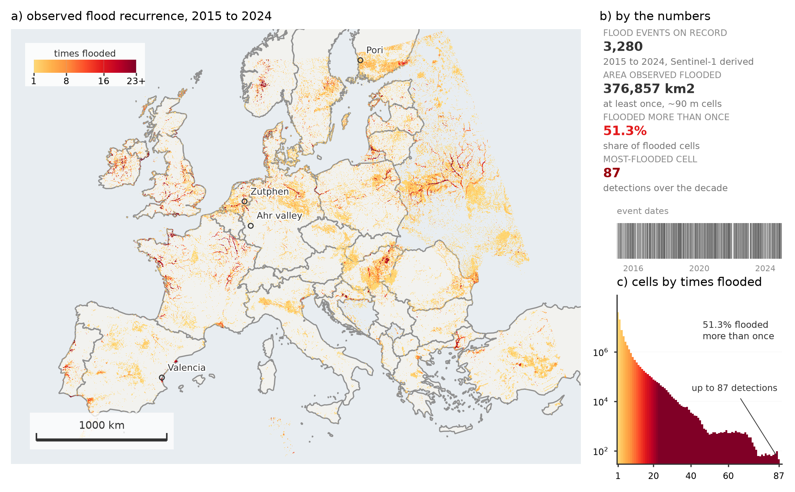

---
hide:
  - navigation
  - toc
---

<div class="euroflood-hero" markdown>

# EuroFlood

**Query Europe's satellite flood-depth maps as GeoDataFrames, in a few lines.**

The CEMS-EFAS archive is open but has no index: just a coordinate in each filename,
which can sit 2,870 km from the flooding. EuroFlood discovers *where and when* floods
happened across Europe from a published index (zero config), then downloads only the
depth rasters you want, no ~19 GB bulk archive, no setup.

[](https://pypi.org/project/euroflood/)
[](https://github.com/cisgroup/euroflood/blob/main/LICENSE)
[](https://github.com/cisgroup/euroflood/actions/workflows/ci.yml)


{ width="720" }
{ width="720" }

[Get started](getting-started.md){ .md-button .md-button--primary }
[Tutorials](tutorials/README.md){ .md-button }
[Case studies](case-studies/README.md){ .md-button }
[API reference](reference/index.md){ .md-button }

</div>

## Install

=== "pip"

    ```bash
    pip install "euroflood[viz]"
    ```

=== "uv"

    ```bash
    uv add "euroflood[viz]"
    ```

## Three lines

```python
import euroflood as ef

cat = ef.floods("Zutphen, Netherlands")  # discover: a GeoDataFrame, one row per flood
cat.plot()                                # visualize: recurrence heatmap, no download
cat.download().stats()                    # measure: fetch depth rasters + per-event stats
```

Zero configuration: the published index is read remotely and cached on first use.

## See it across Europe

{ width="820" .center }

Every place the archive has seen flooded, 2015–2024: **376,857 km²** in all, computed
entirely from the 138 MB index without downloading a single depth raster. Then zoom into
any of it: the [case studies](case-studies/README.md) work through real events, from
Storm Boris to the Valencia DANA.

## Why EuroFlood

<div class="grid cards" markdown>

-   :material-earth:{ .lg .middle } __One API, all of Europe__

    ---

    Continental coverage from ~3,280 Sentinel-1 flood-depth maps (2015–2024), indexed
    so a query streams a few MB, never the ~19 GB archive.

    [:octicons-arrow-right-24: How it works](concepts.md)

-   :material-table:{ .lg .middle } __GeoDataFrames, not tiles__

    ---

    Every query returns a GeoPandas `GeoDataFrame`: filter, clip, join, and export
    with the tools you already use.

    [:octicons-arrow-right-24: Discover & filter](tutorials/02_discover_and_filter.ipynb)

-   :material-map:{ .lg .middle } __Visualize without downloading__

    ---

    Recurrence heatmaps, per-event footprints, and interactive Leaflet maps straight
    from the index, no rasters fetched.

    [:octicons-arrow-right-24: Visualize](tutorials/03_visualize.ipynb)

-   :material-waves:{ .lg .middle } __Global hazard maps__

    ---

    The same API queries modelled **CEMS-GLOFAS** hazard depth for seven return periods
    (10–500 yr): `ef.hazard("Zutphen", return_period=100)`.

    [:octicons-arrow-right-24: Hazard](tutorials/05_hazard.ipynb)

-   :material-console:{ .lg .middle } __CLI & offline__

    ---

    Every query is also a `euroflood` command; mirror the index once for fully
    offline / HPC use.

    [:octicons-arrow-right-24: CLI & configuration](tutorials/07_cli_and_config.ipynb)

-   :material-book-check:{ .lg .middle } __Cited & reproducible__

    ---

    A versioned, checksummed index bundle with a manifest: pin a version, cite the
    source, reproduce a result.

    [:octicons-arrow-right-24: Citing EuroFlood](citation.md)

</div>

## Learn by doing

The **[tutorials](tutorials/README.md)** take you from a first query to hazard maps and
quantitative analysis: runnable notebooks that follow one place (Zutphen, on the
IJssel) throughout. Then see the **[case studies](case-studies/README.md)** for
real-world analyses of genuine events across Europe.

---

EuroFlood **code** is MIT-licensed. The **index and flood-depth maps** derive from the
JRC / Copernicus CEMS-EFAS dataset (CC-BY-4.0). See [Citing EuroFlood](citation.md) for how
to cite the software, the index, and the source data. Developed at Princeton University
(Complex Infrastructure Systems Group).
