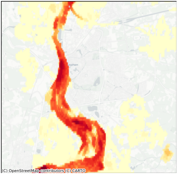
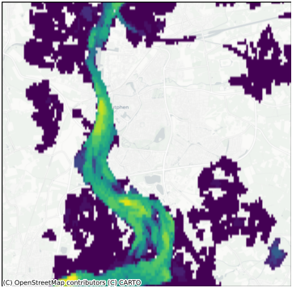
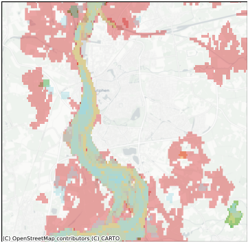
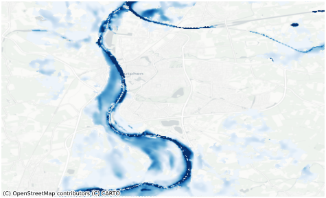
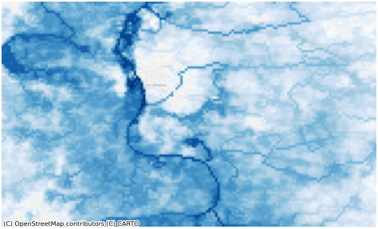
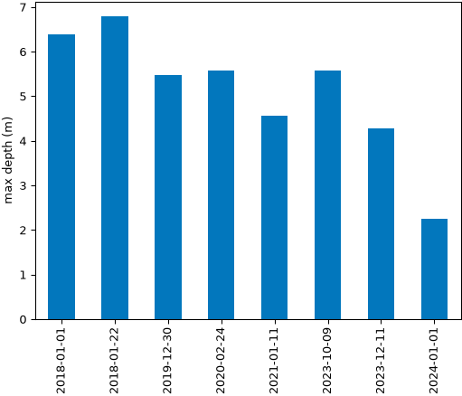
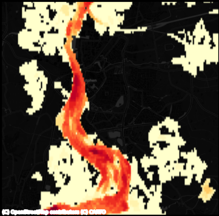

# Tutorials

Short, progressive, **runnable** tutorials for the `euroflood` library. They read the
published index (zero config — `pip install "euroflood[viz]"` and go) and follow one place
throughout: **Zutphen**, a Hanseatic town on the river IJssel in the Netherlands, whose
recurrent high-water flooding makes for a rich, interesting catalogue.

<div class="grid cards" markdown>

-   [](01_quickstart.ipynb)

    __[1. Quickstart](01_quickstart.ipynb)__

    The whole idea in a few lines: query → `.plot()`, straight from the index.

-   [](02_discover_and_filter.ipynb)

    __[2. Discover & filter](02_discover_and_filter.ipynb)__

    Query by place / bbox / point / `shape`; filter by time; it's a GeoDataFrame.

-   [](03_visualize.ipynb)

    __[3. Visualize](03_visualize.ipynb)__

    Recurrence heatmaps, per-event footprints, and interactive folium maps.

-   [](04_download_and_measure.ipynb)

    __[4. Download & measure](04_download_and_measure.ipynb)__

    `.download()` → depth rasters → `DepthRaster` / `.stats()` / `.summary()`.

-   [](05_hazard.ipynb)

    __[5. Hazard](05_hazard.ipynb)__

    Modelled GLOFAS flood-hazard maps by return period (static + interactive).

-   [{ .no-crop }](06_analysis.ipynb)

    __[6. Quantitative analysis](06_analysis.ipynb)__

    Rank events, estimate exposure, compare depths across events.

-   [](07_cli_and_config.ipynb)

    __[7. CLI & configuration](07_cli_and_config.ipynb)__

    The `euroflood` command line, every setting, and offline / HPC use.

</div>

## Run them yourself

```bash
pip install "euroflood[viz]"
jupyter lab examples/             # open the .ipynb, or:
python examples/01_quickstart.py  # the paired .py runs top-to-bottom as a script
```

Each tutorial is a [jupytext](https://jupytext.readthedocs.io/) pair — the `.py` is the
readable source of truth, paired to a `.ipynb` with rich outputs.

## For maintainers

The `.py` and `.ipynb` are kept in sync by the jupytext pre-commit hook (`jupytext --sync`).
The cheap-path tutorials (01, 02, 03, 07) are executed offline against the committed
`tests/fixtures/realdata/index/` bundle on every PR; the download-dependent ones (04, 05, 06)
run in the nightly live workflow. See `.github/workflows/examples.yml`. Regenerate the docs
hero/figure images + these thumbnails with `python scripts/make_doc_images.py`.
